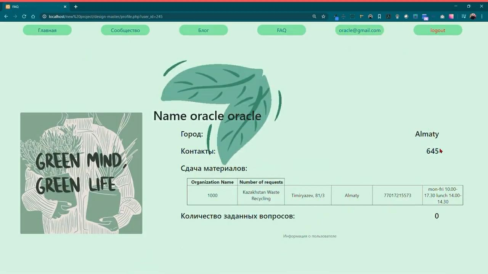
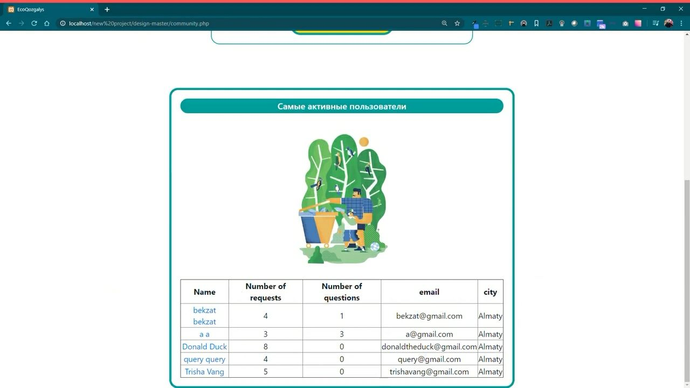
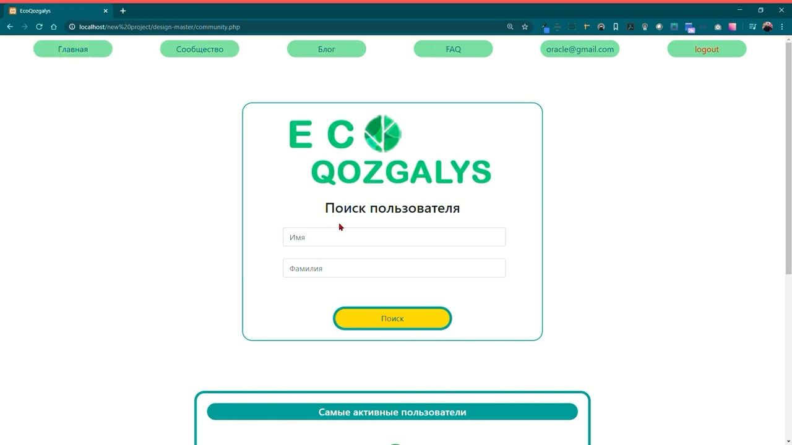
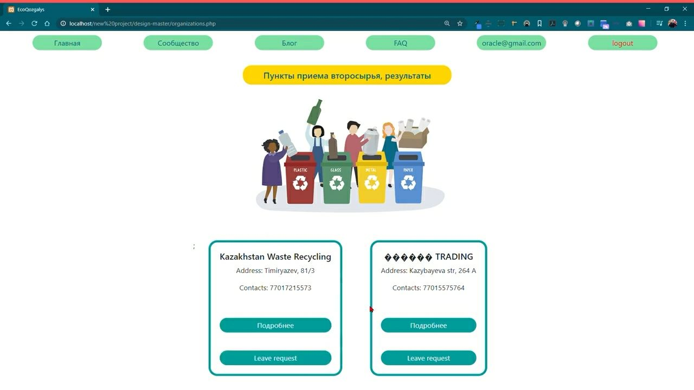
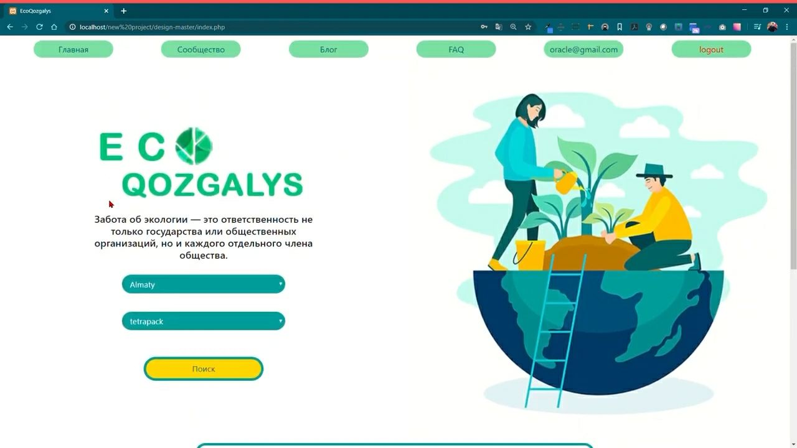
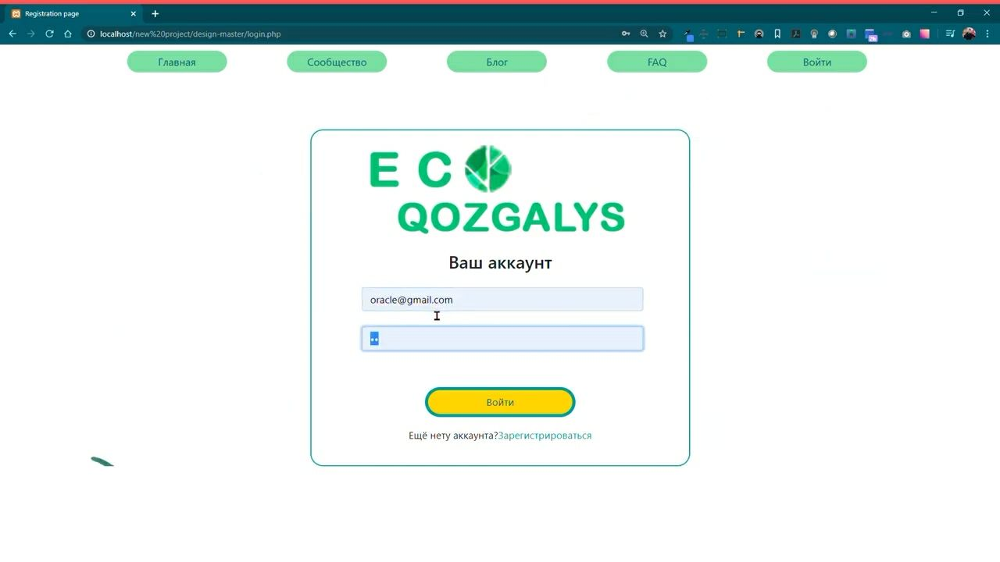
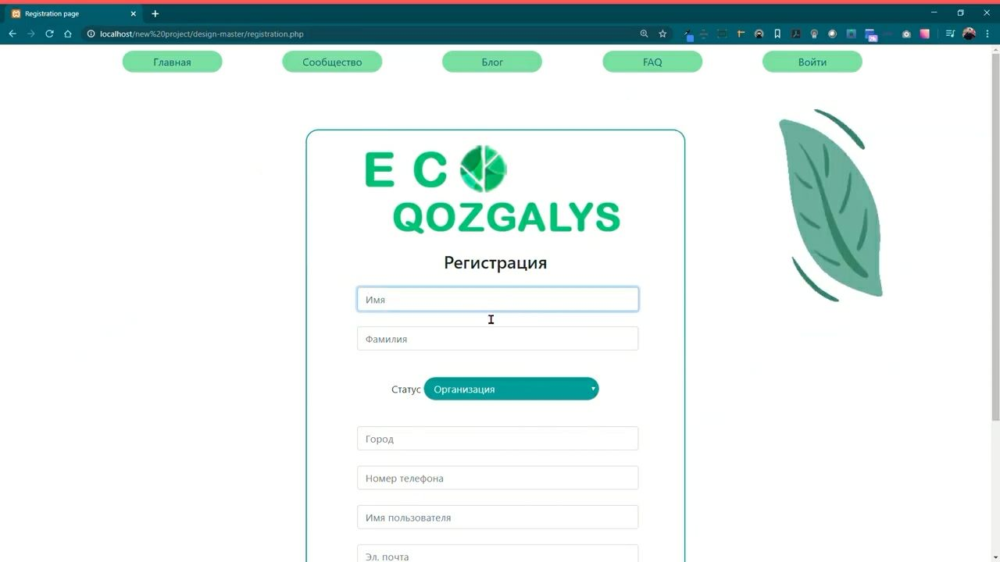
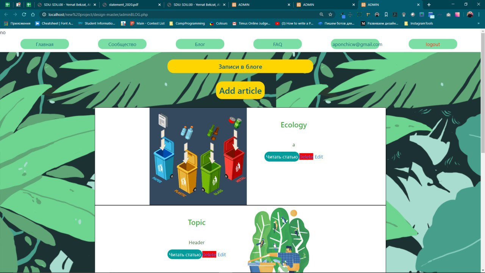
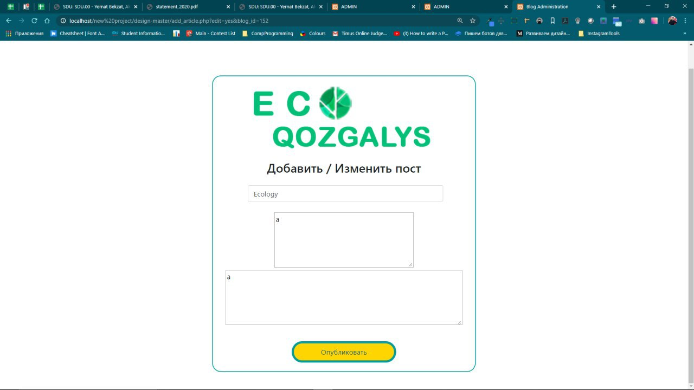

## Collecting the data about organizations
### for now, it's only Almaty city
We have collected the data about recycling points in the city as :
- paper
- glass
- plastic
- metal
- textile
- hazardous waste
- things for REUSE
- electronic waste

